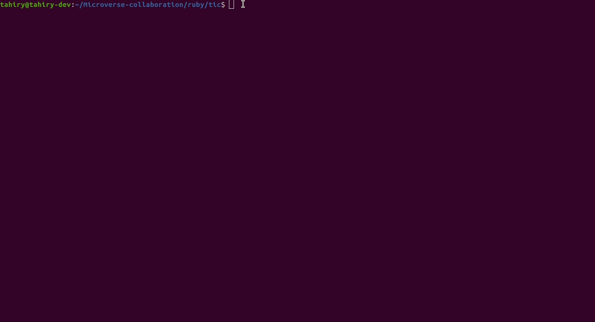

# Tic-Tac-Toe Milestone 3

## Preview

For this project, we wrote a Ruby executable script main.rb that allows the user to play the game of Tic, Tac, Toe in the Terminal.

## How To Play

'Tic, Tac, Toe' is a game for two players played on a board with 9 squares.

Each player is represented by a symbol, either 'X' or 'O'. The players then take turns to place their respective symbols in an empty square on the board, with X's going first - in our version of the game, these squares are represented by an empty board.

The following example game is won by the first player, X:

In the event that all 9 squares are taken without either player getting three of their symbols in a line, a draw is declared.

### Accessing The Game

- To quickly play the game, follow the link in the [Live Demo section](#live-demo) and hit the Run button in the header. The game will begin in the window on the right.

- To download the contents of this repository and play the game locally, follow the steps in the ['Local Installation' section](#local-installation).

## Built With

- Ruby
- VSCode
- Rubocop

## Live Demo

To quickly see our project in action, visit the [live demo](https://repl.it/@StephanAnnandal/GrandioseDarkorchidError#main.rb) on repl.it.

There are no pre-requisites for enjoying the game through this method.

## Local Installation

### Prerequisites

If you intend to download the project, you will need to have Ruby already installed on your machine. For more information on how to install Ruby, follow [this link](https://www.ruby-lang.org/en/downloads/).

### Installation Instructions

To get your own copy of our project simply clone the repository to your local machine.

**Step 1**: Using the Command Line, navigate into the location where you would like to have the repository. Then enter the following line of code:

Clone the repository

**Step 2**: Once the repo has been cloned, navigate inside it by entering the following command:

`cd microverse-ruby-tic-tac-toe`

**Step 3**: Once in the root directory of the repository, simply enter the following line of code to start a game:

`bin/main.rb`

From there, the game will begin, and the user need only follow the subsequent instructions that appear in the Terminal.

## Repository Contents

The code for the project is divided into two main directories: **./bin** and **./lib**.

The **./bin** folder contains the executable **main.rb** file. This is the only executable file that allows interaction of the game via the Terminal. _This is the only file that should be run if you want to play the game._

The **./lib** folder contains subsidiary files that set up all of the classes and methods used in bin/main.rb

- **board.rb**, where the Board class is defined.
- **game.rb**, where the Game class is defined.
- **helpers.rb**, where the Board class is defined.
- **players.rb**, where the Helper class is defined.
- **tictactoe.rb**, where the tictactoe class is defined.
  In addition to the above, the repo also contains .rubocop.yml for linting.

## Tests

1. Open Terminal

2. Install RSpec on your system by running:

   `gem install rspec`

3. Run the tests with the command:

   `rspec`

## Built With

- Ruby
- vscode
- Ruby Rubocop

## Authors

👤 **Stephan**

- Github:   [@sneeu-leeu](https://github.com/sneeu-leeu)
- Twitter:  [@Stephan07484055](https://twitter.com/Stephan07484055)
- Linkedin: [Stephan Annandale](https://www.linkedin.com/in/stephan-annandale-a4b4931a9/) 

👤 **Tahiry**

- Github: [@tahiry-dev](https://github.com/tahiry-dev)
- Twitter: [Tahiry Randriamiarintsoa](https://www.linkedin.com/in/tahiry-randriamiarintsoa-2276831b1/)

## 🤝 Contributing

Contributions, issues and feature requests are welcome!

## Show your support

Give a ⭐️ if you like this project!

